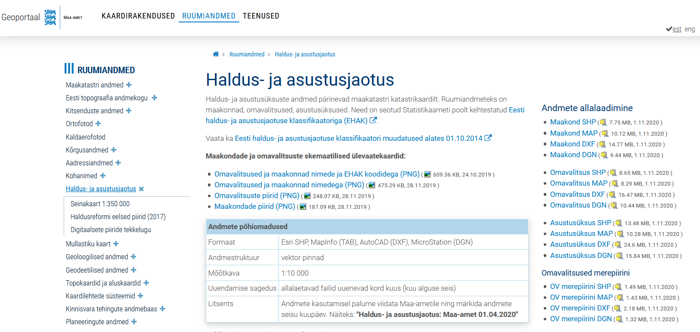
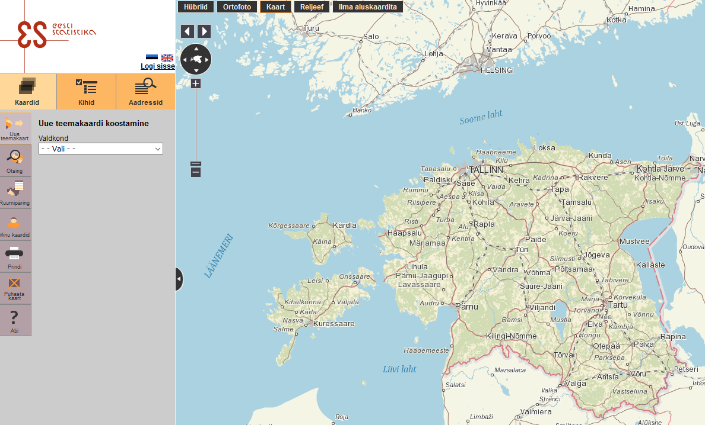
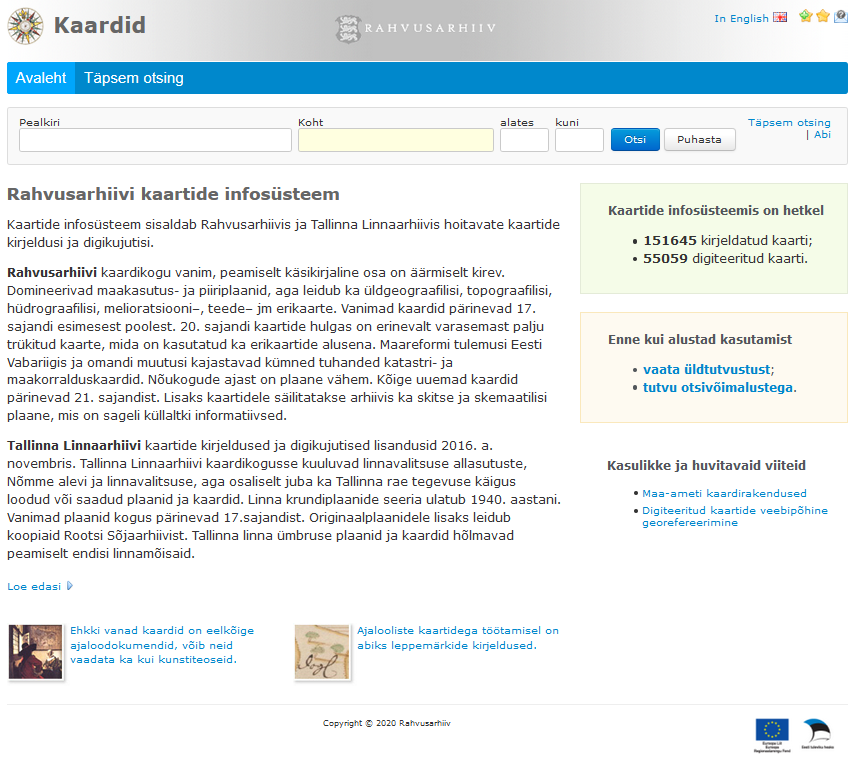
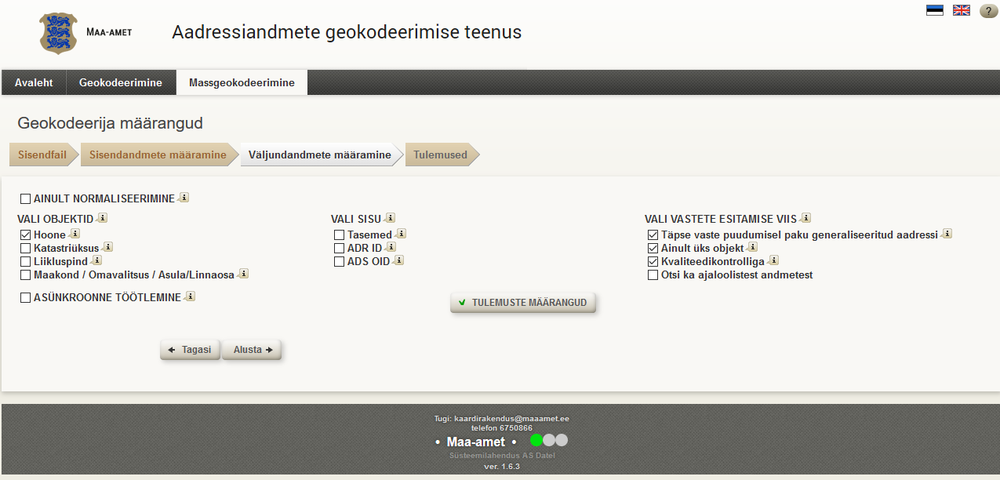

class: inverse, center, middle

# What is space in humanities?


---

# Geographic information system (GIS)

.pull-left[
- spatial data
- management
- collecting
- presentation
- analysis, modeling
]

.pull-right[
.caption[Layer-based working principles]
]

---
# Uses of GIS

.caption[]

---

# GIS software

.pull-left[

]

.pull-right[

]


---

# GIS software

.pull-left[

]

.pull-right[

]

---


# Uses of GIS

.pull-left[.caption[Archaeological predictive model of the state of Illinois]]

.pull-right[.caption[Predictive modeling of Iron Age settlements (Haav 2014)]]

---

# GIS and literature

.caption[]
---

# GIS and historic transport

.caption[]

---
# LiDAR data 

.caption[Archaeological burial sites on public elevation model and high-resolution lidar model]

---
# LiDAR data 

.caption[Rosma hillfort]]

---
# LiDAR data 

.caption[Ancient fields systems]]

---
# Resources for Estonian spacial data

## [Republic of Estonia Land Board](https://geoportaal.maaamet.ee/eng/Spatial-Data-p58.html)

```{r, include = TRUE, echo = FALSE, fig.show="hold", out.width ="100%", fig.align = "center"}

```

---
## Statistics Estonia ([database](https://andmed.stat.ee/et/stat) and [mapping application]((https://estat.stat.ee/StatistikaKaart/VKR))

```{r, include = TRUE, echo = FALSE, fig.show="hold", out.width ="70%", fig.align = "center"}

```

---
## Digital map collections

.pull-left[
[Register of the maps in the National Archives of Estonia](http://www.ra.ee/kaardid/index.php/en)

- Georeferencing (e.g. in QGIS or in the [web]((http://www.georeferencer.com/)) and digitizing

.pull-right[


---
##  Geocoding

- [Republic of Estonia Land Board's geocoder](https://geoportaal.maaamet.ee/est/Teenused/Geokodeerimise-teenus-p440.html)

```{r, include = TRUE, echo = FALSE, fig.show="hold", out.width ="70%", fig.align = "center"}

```

---
## More

- [Estonian Open Government Data Portal](https://opendata.riik.ee/en/)  
- Digitized maps in [DIGAR](https://www.digar.ee/arhiiv/et/pildimaterjal?id=162)  
- [The Book of Estonian Place Names](https://www.eki.ee/dict/knr/)
- [Place Names Database](https://www.eki.ee/knab/p_ee_en.htm)
- [Estonian historical administrative borders in the 20th century](https://archive.org/details/HistoricalAdministrativeBordersOfEstonia)  
- [Wikidata](https://www.wikidata.org/wiki/Wikidata:Main_Page)

---
# Spacial data for other countries

- [Natural Earth Data](https://www.naturalearthdata.com/)    
- [EuroGlobalMap](https://eurogeographics.org/maps-for-europe/open-data/)    
- [DivaGIS](http://www.diva-gis.org/Data)    
- [Robin Wilson's list of free GIS data](http://freegisdata.rtwilson.com/)  
- [Old Maps Online](https://www.oldmapsonline.org/)   
- [David Rumsey's map collection](https://www.davidrumsey.com/)  
- More georeferenced maps in [Mapwarper](https://mapwarper.net/)    
- [Pleiades](https://pleiades.stoa.org/home)  


---
# Tutorials and literature 

**GIS and spatial data in humanities**

- Murrieta-Flores, P., & Martins, B. 2019. The geospatial humanities: past, present and future. 33: 2424–2429 https://www.tandfonline.com/doi/full/10.1080/13658816.2019.1645336.
- Ballas et al. 2018. GIS and the social sciences: Theory and application. Routledge.
- Bolstad. 2016. A first text on geographic information systems, 5th edition.
- Gregory & Geddes. 2014. Toward spatial humanities: Historical gis and spatial history.

**QGIS tutorials**

- [QGIS Project. 2020. A Gentle Introduction to GIS](docs.qgis.org/3.10/en/docs/gentle_gis_introduction/index.html)
- [QGIS Project. 2020. QGIS User Guide. Release 3.10.](docs.qgis.org/3.10/en/docs/user_manual/index.html)
- [Cutts & Graser. 2018. Learn QGIS. Fourth edition](https://www.packtpub.com/product/learn-qgis-fourth-edition/9781788997423)
- [Graser & Peterson. 2020. QGIS Map Design](https://locatepress.com/qmd2)
- [Graser et al. 2017. QGIS Becoming a GIS Power User](https://www.packtpub.com/product/qgis-becoming-a-gis-power-user/9781788299725)

---

class: inverse, middle, center

# Thank you for your attention! 

andres.kimber@ut.ee

twitter.com/andreskimber